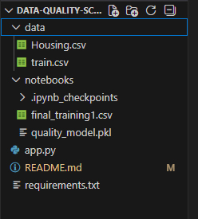
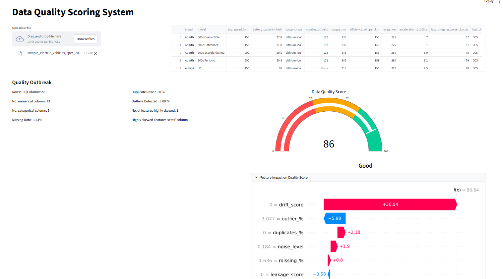

The project evaluates the quality of any uploaded dataset with multiple data
quality dimension like missing values, outliers, duplicates, noise drift and leakage.

The system generates a final Data Quality Scoe(0-100) and provides an interactive dashboard built with Streamlit
Project Overview:
Poor Data Quality leads to unreliable machine learning models and incorrect buisiness decisions. This project introduces an automated framework to quantify dataset quality before model training. 

## Objectives:
* Detect common data quality issues
* Quantify their impact on ML Performance
* Generates a single interpretable Quality score
* Provide an interactive dashboard for real time evaluation

## Ker Features:
* Detect Missing values
* Detect Outliers using IQR
* Identify Duplicate Records
* Measure Noise Level in numeric features
* Detect Skewed Features
* Predict Final Data Quality Score (0-100)
* Interactive Streamlit Dashboard with Guage Meter

## Project Architecture:
1. Data Profiling
2. Issue Injection (Missing, Outlier, Duplicates, Noise, Drift, Leakage)
3. Model Retraining on Corrupted Data
4. Performance Degradation Measurement(R2/RMSE)
5. Meta-Model Training (Predict Qulaity Score)
6. Streamlit Dashboard for Live Dataset Evaluation

## Project Structure:

## Tech Stack:
* Python
* Pandas & Numpy
* Scikit-learn
* SHAP(Model Explainablity)
* Plotly(Guage Meter)
* Streamlit (Dashboard Deployment)

## Streamlit Dashboard :
 Upload any csv dataset to :
 * View dataset statistics
 * Detect quality issues
 * Get final Data Quality Score
 * Visualize score using a guage meter

### Example Output:
* Missing Data %
* Outlier %
* Duplicate Rows %
* Noise Level
* Skewed Feature Count
* Final Quality Score (0-100)

## Model Explainability:

#### SHAP analysis is used to interpret:
* which data issues most affect quality score
* Feature importance for quality degradation
* Drift and Leakage are set to zero by default due to absence of reference distribution and target column during inference

## Future Improvements:

* Automatic Drift Detection
* Real-Time Data Monitoring
* Support for Large -scale Datasets
* Target Distribution and Leakage
* Compute dominant data quality issue for each column 
* Provide actionable suggestions to reduce issues

## Author
Bindhya K.
Data Scientist|Data Analyst | ML Enthusiast

⭐ If you found this project useful, consider giving a star !